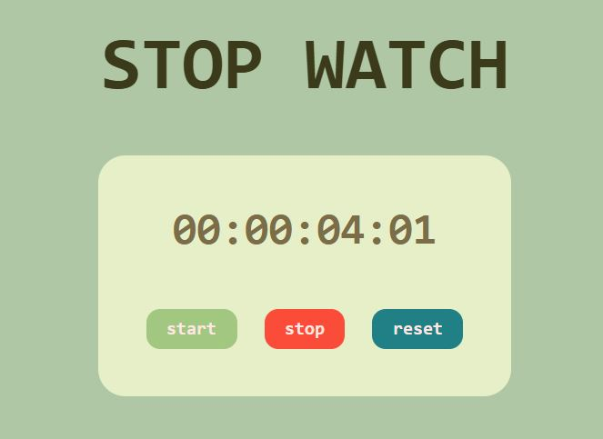

# ⏱️ Stopwatch Web App

A simple and elegant stopwatch built using **HTML**, **CSS**, and **JavaScript**. It features real-time timing with millisecond precision and intuitive start, stop, and reset controls.

## 🌟 Features

- Millisecond-precision stopwatch
- Start, stop, and reset controls
- Clean and responsive user interface
- Vanilla JavaScript—no libraries required

## 🚀 Demo

  

## 🔧 Functionality Overview

- `start()` initiates the stopwatch and updates the display every 10 milliseconds
- `stop()` pauses the stopwatch and retains elapsed time
- `reset()` stops the timer and resets the display to `00:00:00:00`

## 🛠 Technologies Used

- **HTML5** for structure
- **CSS3** for design
- **JavaScript (ES6)** for interactivity

## 📦 How to Run

1. Clone or download this repo
2. Open `index.html` in any modern web browser
3. Click the buttons to control the stopwatch

## 💡 What I Learned

- DOM manipulation with JavaScript
- Time-based functions (`setInterval`, `Date.now`)
- Styling interactive elements with hover effects and layout design

## 📝 License

This project is open-source and free to use for learning or personal projects. Attribution is appreciated if you find it helpful. 💛

